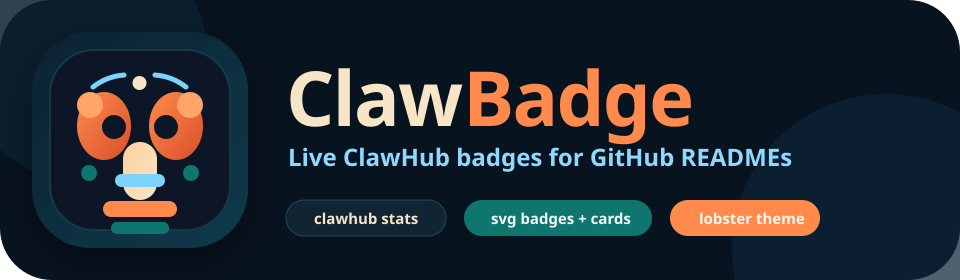
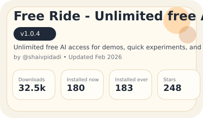

<p align="center">
  
</p>

<p align="center">
  ClawBadge is a read-only badge service that turns public ClawHub skill stats into embeddable GitHub README badges and summary cards.
</p>

<p align="center">
  
  
  
  
</p>

<p align="center">
  
</p>

## Preview

ClawBadge follows the same lobster-forward product direction as OpenClaw and ClawHub: deep ocean backgrounds, warm shell orange accents, and clean registry-style UI elements that still feel technical.

## Features

- Validates skill slugs before any outbound request.
- Fetches public ClawHub skill data with timeout, payload-size limits, and schema validation.
- Normalizes upstream data into a stable JSON shape.
- Caches normalized skill data with fresh and stale windows, with optional shared Redis/KV backing for multi-instance deploys.
- Renders themed SVG metric badges and a richer summary card.
- Provides a generator page with copy-paste markdown snippets.
- Applies per-IP rate limiting for badge, JSON, and generator routes, with optional distributed limiting via shared Redis/KV.
- Returns graceful SVG fallback states for invalid, missing, rate-limited, and unavailable badge requests.

## Stack

- TypeScript
- Hono
- `zod`
- `lru-cache`
- Vitest

## Quick Start

```bash
npm install
cp .env.example .env
npm run dev
```

The local server starts on `http://localhost:3000` by default.

## Environment Variables

| Variable | Default | Purpose |
| --- | --- | --- |
| `PORT` | `3000` | Local Node server port. |
| `CLAWHUB_API_BASE` | `https://clawhub.ai/api/v1` | Fixed upstream base URL. |
| `APP_BASE_URL` | `https://clawhub-badge.xyz` | Canonical public badge domain used in generated markdown snippets. |
| `CACHE_TTL_SECONDS` | `300` | Fresh cache lifetime. |
| `STALE_TTL_SECONDS` | `3600` | Serve-stale window after freshness expires. |
| `UPSTREAM_TIMEOUT_MS` | `2500` | ClawHub request timeout. |
| `MAX_UPSTREAM_BYTES` | `128000` | Maximum accepted upstream payload size. |
| `MEMORY_CACHE_SIZE` | `1000` | Max in-memory cache entries. |
| `UPSTASH_REDIS_REST_URL` | unset | Preferred shared Redis REST URL for multi-instance deploys. |
| `UPSTASH_REDIS_REST_TOKEN` | unset | Preferred shared Redis REST token. |
| `KV_REST_API_URL` | unset | Vercel KV REST URL alternative. |
| `KV_REST_API_TOKEN` | unset | Vercel KV REST token alternative. |
| `REDIS_URL` | unset | Fallback REST URL alias if you want provider-agnostic naming. |
| `REDIS_TOKEN` | unset | Fallback REST token alias. |
| `REDIS_KEY_PREFIX` | `clawbadge` | Namespace prefix for shared cache and rate-limit keys. |
| `RATE_LIMIT_ENABLED` | `1` | Enables per-IP throttling. |
| `LOG_LEVEL` | `info` | Structured log threshold. |

If no shared Redis/KV credentials are set, ClawBadge uses only per-process in-memory caching and rate limiting.

## Routes

### Health

- `GET /api/health`

### Normalized JSON

- `GET /api/skills/:slug`

Example response:

```json
{
  "slug": "free-ride",
  "displayName": "Free Ride - Unlimited free AI",
  "summary": "...",
  "version": "1.0.4",
  "downloads": 32517,
  "installsCurrent": 180,
  "installsAllTime": 183,
  "stars": 248,
  "comments": 23,
  "versions": 4,
  "owner": {
    "handle": "Shaivpidadi",
    "displayName": "Shaishav Pidadi"
  },
  "createdAt": 1770313337350,
  "updatedAt": 1772065840450,
  "source": "clawhub"
}
```

### SVG badges

- `GET /badge/:slug/downloads.svg`
- `GET /badge/:slug/installs-current.svg`
- `GET /badge/:slug/installs-all-time.svg`
- `GET /badge/:slug/stars.svg`
- `GET /badge/:slug/version.svg`
- `GET /badge/:slug/card.svg`

Supported query params:

- `theme=default|dark|flat`
- `label=...` for single-stat badges
- `compact=1` for the card
- `showOwner=1` for the card
- `showUpdated=1` for the card

### Generator UI

- `GET /`
- `GET /generate/:slug`

## Example Markdown

Examples below use your purchased domain `https://clawhub-badge.xyz`:

```md
[](https://clawhub.ai/skills/free-ride)
[](https://clawhub.ai/skills/free-ride)
[](https://clawhub.ai/skills/free-ride)
[](https://clawhub.ai/skills/free-ride)
[](https://clawhub.ai/skills/free-ride)
```

## Development Commands

```bash
npm run dev
npm run typecheck
npm run build
npm test
npm run test:update
```

## Testing

The suite covers:

- slug validation
- upstream normalization/version fallback
- stale-cache behavior
- rate limiting
- shared cache serialization
- distributed rate limit windows
- route responses
- SVG snapshot output

## Deployment

### Node container or VM

```bash
npm install
npm run build
npm start
```

### Vercel

The repo includes:

- [`api/index.ts`](api/index.ts) using Hono’s Vercel adapter
- [`vercel.json`](vercel.json) rewriting all routes to the function entrypoint

Deploy the repository directly on Vercel and set the same environment variables listed above.
For public production traffic on Vercel, also set a shared Redis/KV REST credential pair so cache entries and rate limits are shared across instances.

### Cloudflare Workers

The repo includes [`wrangler.toml`](wrangler.toml) with `src/app.ts` as the worker entrypoint. Set production values with Wrangler or the Cloudflare dashboard before publishing. For distributed caching and rate limiting, configure a shared Redis/KV REST backend in the Cloudflare dashboard secrets/vars.

## Security Notes

- ClawBadge never accepts arbitrary upstream URLs.
- Skill slugs are strictly validated with `^[a-z0-9]+(?:-[a-z0-9]+)*$`.
- Upstream responses are size-limited, timed out, and schema-validated.
- SVG text is escaped before rendering.
- Public routes use cache headers and per-IP rate limiting.
